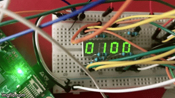

# ulx3s_numeric_display

The goal of this project is to be able to use 4-digit 7-segment displays as an easy and quick method of debugging/data display. OLED screens are really convenient but they require more complex logic and memory buffers to contain the graphical data, so I think having these displays as an alternative for simple debugging can help a lot for quick iteration and debugging.

## Design

In order to be able to interface one of these displays you need 12 pins, so the design uses two 74HC164N serial-to-parallel ICs to be able to interface all pins using just 4 data signals (+ VCC/GND). Segment data and digit data are generated at a pre-defined rate (by default in this design - 400Hz) and fed to these chips that rely them to the display. Only some transistors and resistors are required besides these connections to make it all work.

## Components

- `clk_divider`: configurable clock divider used to drive the 74HC164N (at 6MHz) and the refresh rate for the LED display.
- `shifter`: a shifter module that's able to perform multiple shift/rotation operations.
- `reset`: simple reset controller.
- `wb_hc164`: module that interfaces communication with 74HC164N ICs using a simplified Wishbone bus.
- `led_display_controller`: module to drive the LED display through two 74HC164N. Users can place raw segment data for each one of the digits.
- `numeric_led_display_controller`: small wrapper on top of the previous module. Users just need to pass a 16 bit number and it'll be displayed in hexadecimal form by the LED display.
- `top`: an example of using these, dislaying a second counter.

## Board

Warning: the PCB hasn't been tested yet, but the design has been found to work using a breadboard. I'll update this as soon as I get it built and running :). If in any case you want to play this, KiCAD design files are [available here](board).